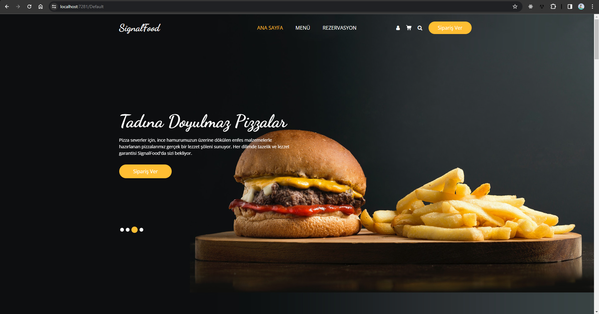
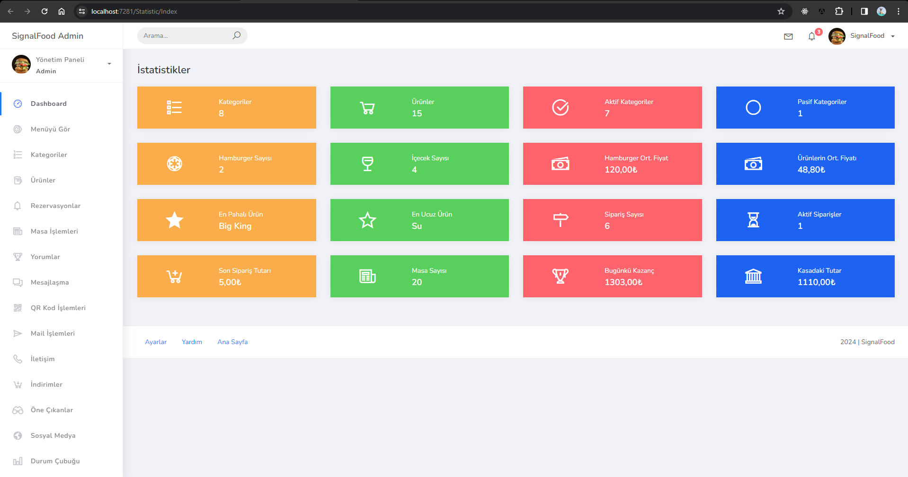

# SignalFood
1. Start from Api - Ctrl F5
2. Run after UI Page - Ctrl Shift W

## Addresses
```cs
Web Site    =  https://localhost:7281/Default/Index
Admin Page  =  https://localhost:7281//Statistic/Index
```

### Project Layers
```cs
    EntityLayer
    DataAccessLayer => EntityLayer + DtoLayer
    BusinessLayer   => DataAccessLayer + EntityLayer + DtoLayer
    SignalFoodApi   => BusinessLayer + DataAccessLayer + EntityLayer + DtoLayer
    
    SignalFoodWebUI => DataAccessLayer + EntityLayer + DtoLayer
```

### Packages of SignalFood Project Layers
```cs
    EntityLayer
    -- Microsoft.AspNetCore.Identity 2.2.0
    -- Microsoft.AspNetCore.Identity.EntityFrameworkCore 6.0.25
```
```cs
    DataAccessLayer
    - Microsoft.EntityFrameworkCore 6.0.25
    - Microsoft.EntityFrameworkCore.Design 6.0.25
    - Microsoft.EntityFrameworkCore.SqlServer 6.0.25
    - Microsoft.EntityFrameworkCore.Tools 6.0.25
    -- Microsoft.AspNetCore.Identity 2.2.0
    -- Microsoft.AspNetCore.Identity.EntityFrameworkCore 6.0.25
```
```cs
    SignalFoodApi
    - AutoMapper 12.0.1
    - AutoMapper.Extensions.Microsoft.DependencyInjection 12.0.1
    - Microsoft.EntityFrameworkCore.Design 6.0.25
    - Swashbuckle.AspNetCore 6.5.0
```
```cs
    SignalFoodWebUI
    - client-side library - @microsoft/signalr@6.0.6
    -- Microsoft.AspNetCore.Identity 2.2.0
    -- Microsoft.AspNetCore.Identity.EntityFrameworkCore 6.0.25
    -- Microsoft.EntityFrameworkCore 6.0.25
    -- Microsoft.EntityFrameworkCore.Design 6.0.25
    --- NETCore.MailKit 2.1.0
```

Use this commands for the `Migration Operations`:
- Create Migration
```
    PM> Add-Migration [MigrationName]
```
- Update Data   (Add Configurations)
```
    PM> Update-Database
```
- Remove Last Migration
```
    PM> Remove-Migration
```
- Drop the Database
```
    PM> Drop-Database
```

### QR Code

<br />
```
UI --> Dependencies --> Add Project Reference --> Browse... --> QRCoder.dll Add
```

### Google Key
```
Manage Your Google Account --> App Passwords --> Application Name
Google Hesabınızı Yönetin  --> Uygulama Şifreleri --> Uygulama Adı
```

## SignalFood Project [Images](https://github.com/AtakanTurgut/SignalFood/tree/unique/pictures)
### 1. Home Page:  https://localhost:7281/Default/Index


### 2. Admin Page:  https://localhost:7281//Statistic/Index
